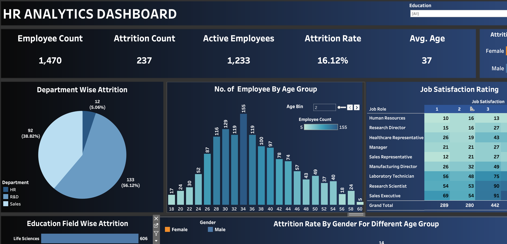

# 📊 HR Analytics Dashboard

This Tableau dashboard provides a detailed, interactive view of key Human Resources metrics. Designed for HR professionals and decision-makers, it offers insights into employee demographics, attrition trends, departmental performance, and workforce engagement.

---

## 🔗 Live Dashboard

🔍 [Click here to view the dashboard](https://public.tableau.com/app/profile/pankaj.sajjanar/viz/HR_Analytics_Dashboard_17431054898220/HRANALYTICSDASHBOARD?publish=yes)

---

## 🎯 Features

- **Employee Demographics**  
  Breakdown by gender, age, education, and marital status.

- **Attrition Analysis**  
  Understand turnover patterns across departments and job roles.

- **Departmental Insights**  
  View employee distribution and performance by department.

- **Performance Ratings**  
  Assess trends in employee evaluations and identify top performers.

- **Interactive Filters**  
  Easily drill down by department, job role, education, and more.

---

## 🛠 Tech Stack

- **Tool**: Tableau Public  
- **Data Processing**:  Excel, SQL, Python
- **Visualization Type**: Interactive dashboard with filters, bar charts, KPIs, and pie charts

---

